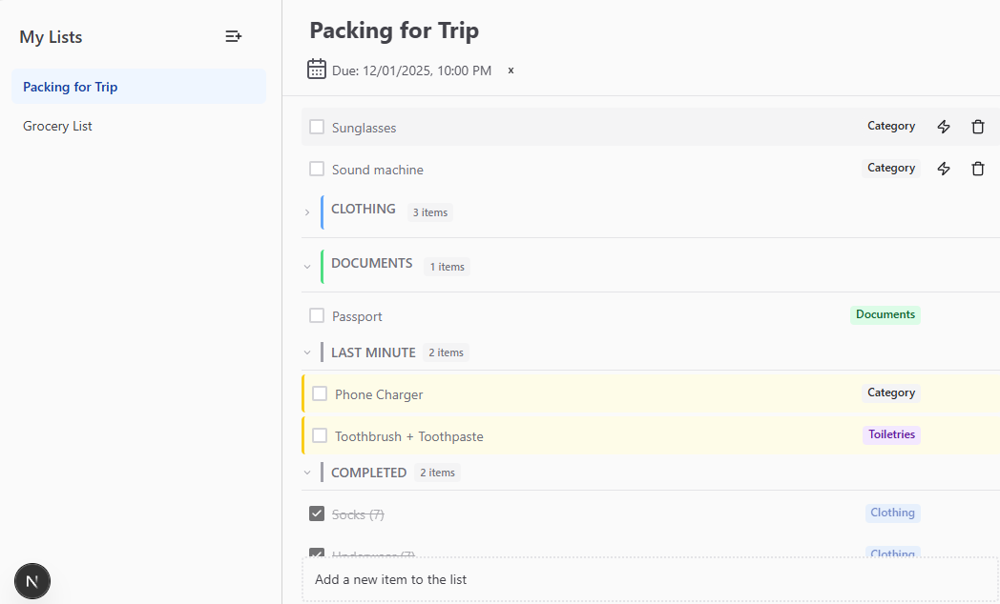
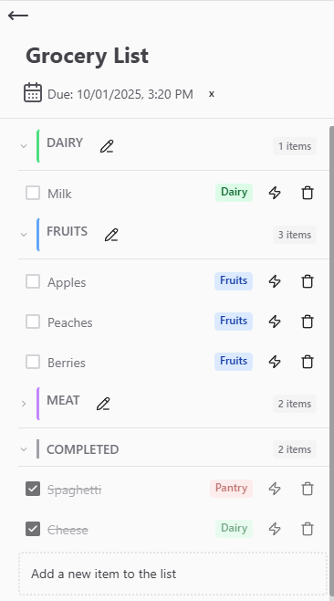

# QuickList

A  **list manager** built with a **Next.js + GraphQL + Prisma**.  
Designed for simplicity, speed, type safety, and scalability
## 📸 See it Live
- Deployed on https://quickquacklist.netlify.app/

Desktop Screenshot



Mobile Screenshot 



## 🛠 Tech Stack
### Core

- Framework: Next.js 15
 (App Router, Server Components)

- Language: TypeScript 5

- Frontend: React 19

### UI / UX

- Chakra UI v3
 for design system and accessible components

- Lucide React iconography

- React Datepicker
 for intuitive date handling


### Backend / API

- GraphQL
 with Apollo Server

- Apollo Client
 for frontend data fetching

- Prisma ORM
 with PostgreSQL (Supabase-ready)

- GraphQL Code Generator
 for type-safe queries & hooks

## ⚡ Getting Started
1. Clone and install `npm install`
2. Configure PostgreSQL database and set up .env

```
//.env
DATABASE_URL="YOUR-DATABASE-URL"
```
3. Prisma ORM set up
```
bash
npx prisma migrate dev --name init
npx prisma db seed
```
4. Run the Dev Server ```npm run dev```

### Stretch Goals (Upcoming!)
- Drag and Drop
- Multi-user collaboration
- Mobile notifications
